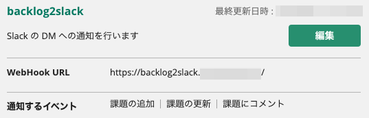

# backlog2slack


バックログの通知を Slack の Direct Message で受け取ります。
チケットの通知先に指定されているユーザーに DM で届くので、自分と関係ないタスクに煩わされることがありません。

> 通知対象となっている Backlog ユーザーのメールアドレスと Slack ユーザーのメールアドレスを照合して DM 先を抽出しているため、双方のツールで同じメールアドレスを設定してください。

AWS CDK で構築、CloudFront + Lambda で動作するため、低コストで運用できます。

## 必要なもの

- node 18.x + npm 9.x
- Backlog API Key
- Slack Bot Token & Signing Secret

## Setup

### パッケージの準備

#### NPM Package のインストール

```command-line
npm install
```

#### cdk.context.json の作成

cdk.context.json.example を複製し、適切な値をセットしてください。

- backlogAPIKey: Backlog の API キーです。Backlog の「個人設定 - API」で API キーを発行してください。
- backlogHost: `[スペース名].backlog.jp` になります。
- domainName: Backlog の更新通知を受け取るための URL のドメイン名です。Route53 で管理された適当なドメイン(HostedZone)を指定してください。
- hostName: Backlog の更新通知を受け取るための URL のホスト名です。domainName で指定したゾーンにレコードが自動作成されます。
- slackBotToken: Slack の Bot Token です。アプリを新規に作成し、Token を生成してください。
- slackSigningSecret: Slack の署名用秘密鍵です。アプリを新規に作成し、Secret を生成してください。

#### AWS CDK を使用して deploy

以下の2つのスタックを CDK でデプロイします。

- Backlog2SlackAcmStack
  - CloudFront でカスタムドメインを利用するための証明書を発行するスタックです。us-east-1 で発行する必要があるため、スタックを分離しています。
- Backlog2SlackStack
  - メインのスタックです。

```command-line
npm run cdk deploy -- --all
```

### Backlog 側の設定

`https://{hostName}.{domainName}/` を Backlog の Webhook に登録してください。
通知するイベントには、「課題の追加」「課題の更新」「課題にコメント」を選択してください。


